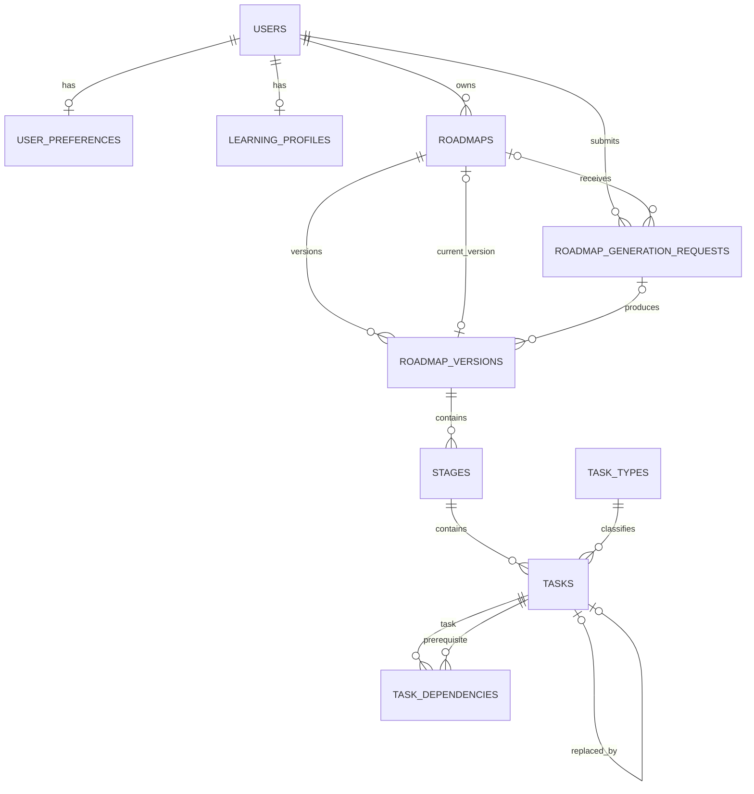

# AI Mentor Backend

Laravel 12 foundation for the AI Mentor platform. This phase establishes the
identity, learning-profile, roadmap, roadmap-version, stage, task, dependency,
and roadmap-generation-request persistence model. AI generation, mentor chat,
progress, resources, and adaptation workflows are intentionally deferred.

## Architecture

The backend is a modular monolith. A single deployment and database keep the
initial operational model simple, while module boundaries keep domain changes
local and leave room for later extraction only when evidence justifies it.

```text
app/
├── Modules/
│   ├── Identity/
│   │   ├── Domain/Enums
│   │   └── Infrastructure/Persistence/Models
│   ├── LearningProfile/
│   │   ├── Domain/Enums
│   │   └── Infrastructure/Persistence/Models
│   ├── Roadmap/
│   │   ├── Domain/{Enums,ActiveRoadmapSlot.php}
│   │   ├── Application/Actions
│   │   └── Infrastructure/Persistence/Models
│   └── TaskExecution/
│       ├── Domain/Enums
│       ├── Application/Actions
│       └── Infrastructure/Persistence/Models
└── Shared/
    └── Presentation/Http/{Controllers,Middleware,Resources}
```

Only directories with real responsibilities are present. Presentation calls
Application, Application coordinates Domain rules, and Infrastructure provides
Laravel/Eloquent implementations. Domain code does not depend on HTTP.

### Module boundaries

- **Identity** owns users, authentication identity, and user preferences.
- **LearningProfile** owns persisted onboarding inputs used to personalize a plan.
- **Roadmap** owns roadmap lifecycle, immutable versions, and ordered stages.
- **TaskExecution** owns task taxonomy, task state, replacements, and dependencies.
- **Shared** contains the API transport concerns genuinely shared across modules.

## Data model



All public entity identifiers and foreign keys are ULIDs. Timestamps are stored
in UTC. MySQL is the source of truth; Redis backs cache, sessions, queues, and
Horizon.

The database permits many historical roadmaps per user but enforces at most one
current roadmap with `UNIQUE (user_id, active_slot)`. The current record uses
`active_slot = 1`; inactive records use `NULL`. The `ActivateRoadmap` action is
the single application-level mutation path for this rule.

## API

All endpoints are versioned under `/api/v1`.

```http
GET /api/v1/health
```

Responses use `data` or `error` plus `meta.request_id`. The same ULID request ID
is returned in `X-Request-ID`. Production API errors do not expose stack traces
or database details.

## Local setup

Requires PHP 8.3+ (PHP 8.4 is supported), Composer, MySQL 8, and Redis. When PHP
is unavailable locally, Composer's Docker image can run the framework and the
test suite with SQLite:

```bash
cp .env.example .env
docker volume create ai-mentor-vendor
docker run --rm -v ai-mentor-vendor:/app/vendor -v "$PWD:/app" -w /app composer:2 composer install --ignore-platform-req=ext-pcntl
docker run --rm -v ai-mentor-vendor:/app/vendor -v "$PWD:/app" -w /app composer:2 php artisan key:generate
docker run --rm -e DB_CONNECTION=sqlite -e DB_DATABASE=:memory: -v ai-mentor-vendor:/app/vendor -v "$PWD:/app" -w /app composer:2 php artisan migrate:fresh --seed
```

Horizon workers require the `pcntl` and `posix` extensions and must run on a
Linux PHP worker image. The Horizon dashboard is intentionally denied outside
the local environment until the administrative authorization model is added.

For the production-like database configuration, set the MySQL and Redis values
from `.env.example`. Never commit `.env` or provider credentials.

## Quality gates

```bash
composer validate
php artisan migrate:fresh --seed
php artisan test
vendor/bin/pint --test
vendor/bin/phpstan analyse
php artisan route:list --path=api/v1
```

The automated suite uses SQLite for fast feedback and explicitly tests database
invariants. Run migrations against MySQL 8 before release because SQLite differs
in constraint and DDL behavior. The MySQL-only self-dependency `CHECK` is added
by the migration; the Domain rule protects every supported database.

## Architecture decisions

- [ADR-001: Modular Monolith](docs/architecture/ADR-001-modular-monolith.md)
- [ADR-002: ULID Identifiers](docs/architecture/ADR-002-ulid-identifiers.md)
- [ADR-003: Single Active Roadmap](docs/architecture/ADR-003-single-active-roadmap.md)

## Deferred to the next phase

Authentication endpoints, roadmap generation and provider adapters, chat,
resource discovery, task completion/progress, adaptation proposals, policies and
ownership-scoped product endpoints, observability, deployment, and the admin
surface are outside this foundation phase.
