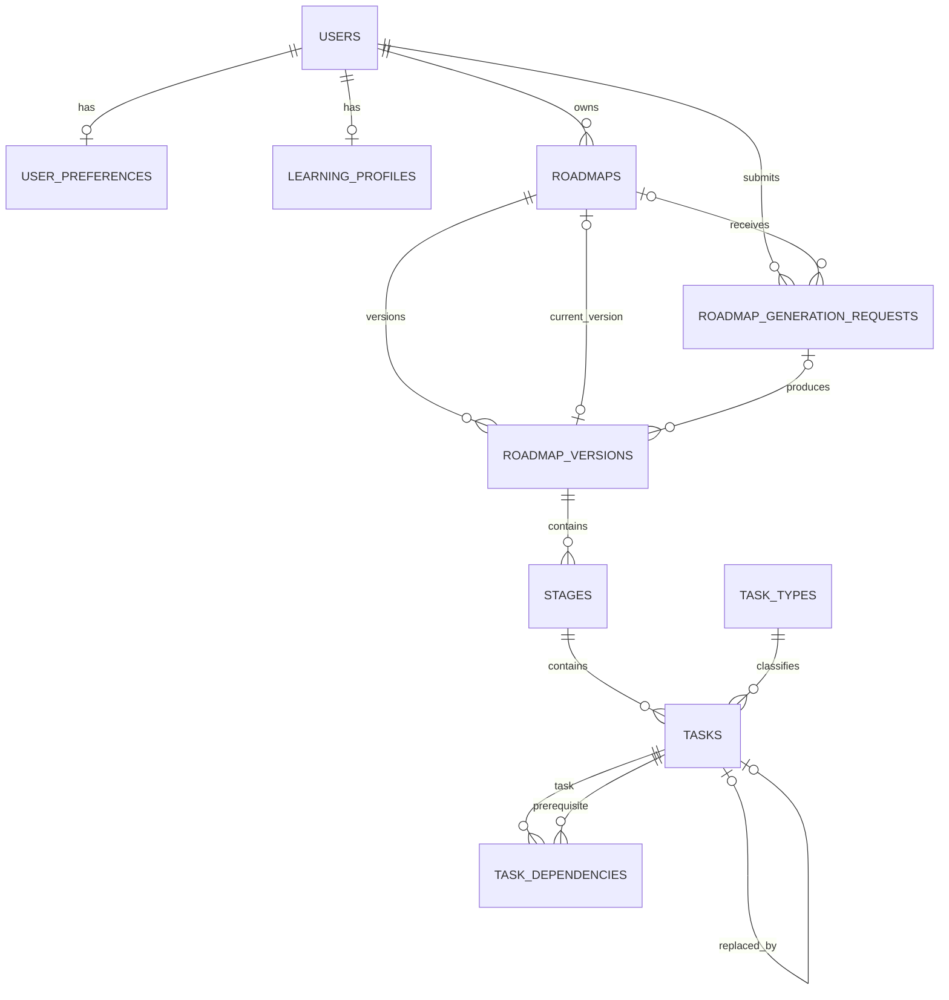

# AI Mentor Backend

Laravel 12 foundation for the AI Mentor platform. This phase establishes the
identity, learning-profile, roadmap, roadmap-version, stage, task, dependency,
and roadmap-generation-request persistence model. AI generation, mentor chat,
progress, resources, and adaptation workflows are intentionally deferred.

## Architecture

The backend is a modular monolith. A single deployment and database keep the
initial operational model simple, while module boundaries keep domain changes
local and leave room for later extraction only when evidence justifies it.

```text
app/
├── Modules/
│   ├── Identity/
│   │   ├── Domain/Enums
│   │   ├── Application/{Actions,Data,Exceptions,Queries}
│   │   ├── Infrastructure/Persistence/Models
│   │   └── Presentation/Http/{Controllers,Requests,Resources}
│   ├── LearningProfile/
│   │   ├── Domain/Enums
│   │   ├── Application/{Actions,Exceptions,Queries}
│   │   ├── Infrastructure/Persistence/Models
│   │   └── Presentation/Http/{Controllers,Requests,Resources}
│   ├── Roadmap/
│   │   ├── Domain/{Enums,ActiveRoadmapSlot.php}
│   │   ├── Application/Actions
│   │   └── Infrastructure/Persistence/Models
│   └── TaskExecution/
│       ├── Domain/Enums
│       ├── Application/Actions
│       └── Infrastructure/Persistence/Models
└── Shared/
    └── Presentation/Http/{Controllers,Middleware,Resources}
```

Only directories with real responsibilities are present. Presentation calls
Application, Application coordinates Domain rules, and Infrastructure provides
Laravel/Eloquent implementations. Domain code does not depend on HTTP.

### Module boundaries

- **Identity** owns users, authentication identity, and user preferences.
- **LearningProfile** owns persisted onboarding inputs used to personalize a plan.
- **Roadmap** owns roadmap lifecycle, immutable versions, and ordered stages.
- **TaskExecution** owns task taxonomy, task state, replacements, and dependencies.
- **Shared** contains the API transport concerns genuinely shared across modules.

## Data model



All public entity identifiers and foreign keys are ULIDs. Timestamps are stored
in UTC. MySQL is the source of truth; Redis backs cache, sessions, queues, and
Horizon.

The database permits many historical roadmaps per user but enforces at most one
current roadmap with `UNIQUE (user_id, active_slot)`. The current record uses
`active_slot = 1`; inactive records use `NULL`. The `ActivateRoadmap` action is
the single application-level mutation path for this rule.

## API

All endpoints are versioned under `/api/v1`.

```http
GET /api/v1/health
POST /api/v1/auth/register
POST /api/v1/auth/login
POST /api/v1/auth/logout
GET /api/v1/me
GET /api/v1/me/preferences
PATCH /api/v1/me/preferences
GET /api/v1/me/learning-profile
PUT /api/v1/me/learning-profile
GET /api/v1/me/onboarding-status
POST /api/v1/roadmap-generation-requests
GET /api/v1/roadmap-generation-requests/{generationRequest}
GET /sanctum/csrf-cookie
```

Responses use `data` or `error` plus `meta.request_id`. The same ULID request ID
is returned in `X-Request-ID`. Production API errors do not expose stack traces
or database details.

### SPA authentication

Authentication uses Sanctum's stateful browser flow and the `web` session
guard. It never creates personal access tokens and never returns bearer tokens.
Registration also creates the user's default preferences (`en`, `both`, `UTC`)
in the same database transaction. Login is limited to active accounts and uses
one generic validation error for unknown credentials, wrong passwords,
suspended users, and deletion-requested users.

The browser must send credentials on every request. Before registration, login,
or logout, request `GET /sanctum/csrf-cookie`, then send the URL-decoded
`XSRF-TOKEN` cookie as the `X-XSRF-TOKEN` header. Successful registration and
login rotate the session identifier. Logout invalidates the session and rotates
its CSRF token. Login is limited to five attempts per minute for each normalized
email and IP pair; registration is limited to three attempts per minute per IP.

Set `FRONTEND_URL`, `SANCTUM_STATEFUL_DOMAINS`, and
`CORS_ALLOWED_ORIGINS` explicitly for each environment. CORS allows credentials
and never uses a wildcard origin. Session cookies are HTTP-only. The local
examples use `SameSite=Lax`, which is appropriate when the frontend and API are
same-site (different ports are allowed). For a truly cross-site production SPA,
use `SESSION_SAME_SITE=none`, `SESSION_SECURE_COOKIE=true`, and HTTPS; otherwise
keep `Lax`. Production must always set `SESSION_SECURE_COOKIE=true`.

### Preferences and learning-profile onboarding

All `/api/v1/me/*` endpoints require the Sanctum browser session described
above. Ownership always comes from the authenticated session: clients must not
send `user_id`, IDs, timestamps, or completion fields. Preferences contain UI
and localization settings; the learning profile contains the inputs that will
later personalize a roadmap. This phase does not generate a roadmap, dispatch a
job, or call an AI provider.

Preferences support partial updates:

```http
GET /api/v1/me/preferences
PATCH /api/v1/me/preferences
Content-Type: application/json

{
  "ui_locale": "ar",
  "resource_language": "both",
  "timezone": "Asia/Hebron"
}
```

`ui_locale` accepts `ar` or `en`; `resource_language` accepts `ar`, `en`, or
`both`. `timezone` must be a real IANA timezone identifier such as `UTC`,
`Asia/Hebron`, or `America/Toronto`. PATCH accepts any non-empty subset and
preserves omitted values. Registrations create defaults (`en`, `both`, `UTC`).
A legacy user without a preferences row receives `404
user_preferences_not_found`; GET never repairs or writes data implicitly.

The idempotent learning-profile request is:

```http
PUT /api/v1/me/learning-profile
Content-Type: application/json

{
  "goal": "Learn Laravel architecture",
  "self_assessed_level": "some_experience",
  "desired_outcome": "Ship a maintainable backend service",
  "available_minutes_per_week": 300,
  "preferred_learning_methods": ["hands_on_projects", "reading_docs"]
}
```

All five fields are required by onboarding. `goal` is limited to 1,000
characters and `desired_outcome` to 2,000. `self_assessed_level` accepts
`complete_beginner`, `some_experience`, or `intermediate`.
`available_minutes_per_week` is the normalized persisted pace budget and must be
an integer from 15 through 10,080. The distinct, non-empty learning-method array
accepts `hands_on_projects`, `reading_docs`, `video_walkthroughs`, and
`quizzes_drills`.

The first valid PUT returns `201`; later identical or changed PUTs return `200`
and retain the same profile and owner. GET returns `200` when the profile exists
or `404 learning_profile_not_found` otherwise. Successful responses retain the
standard `data` and `meta.request_id` envelope; validation failures return `422`,
and missing authentication returns `401`. Existing incomplete rows may expose
the schema-nullable `desired_outcome` or `preferred_learning_methods` as `null`;
they remain incomplete until replaced by a valid PUT.

Onboarding status is derived rather than accepted from the client or stored as
an authoritative flag:

```json
{
  "data": {
    "completed": false,
    "missing_fields": ["desired_outcome"]
  },
  "meta": {"request_id": "..."}
}
```

`GET /api/v1/me/onboarding-status` reports missing required learning-profile
fields and `resource_language`. A valid default preference satisfies the latter;
legacy users without a preferences row remain incomplete. The historical
nullable `onboarding_completed_at` column is not exposed and is not used as the
source of truth.

### Roadmap generation request contract

An authenticated user with complete onboarding can open the asynchronous
generation lifecycle without starting generation in this phase:

```http
POST /api/v1/roadmap-generation-requests
Idempotency-Key: generation-attempt-01
```

The body must be empty. `Idempotency-Key` is required, accepts 8–128 safe ASCII
characters, is SHA-256 hashed before persistence, and is unique per user. A new
request returns `202` in `queued` state. Replaying the same user/key returns the
same immutable request and snapshot: active replays return `202`, while terminal
replays return `200`. A different key while a request is `queued`, `running`, or
`validating` returns `409 roadmap_generation_in_progress`. The terminal states
are `succeeded`, `failed`, and `cancelled`.

The creation endpoint is limited to three attempts per minute per authenticated
user. It locks the user row during creation, and MySQL independently enforces
both per-user idempotency and a single active request. Incomplete onboarding
returns `409 onboarding_incomplete` with the canonical `missing_fields` list.

The immutable schema-version-1 snapshot contains only the current learning
profile fields and `preferences.resource_language`. It excludes UI locale,
timezone, client input, and provider metadata. The status endpoint is strictly
owner scoped; unknown and foreign identifiers both return `404
roadmap_generation_request_not_found`. Public resources do not expose the
snapshot, hashes, raw keys, provider payloads, validated output, or internal
failure messages.

```http
GET /api/v1/roadmap-generation-requests/{generationRequest}
```

This contract only persists and retrieves lifecycle requests. It intentionally
does not create a roadmap/version/stage/task, dispatch a job, call an AI
provider, or issue a personal access token.

## Docker development environment

Docker is the supported local runtime. It provides PHP 8.4 with NGINX and FPM in
one unprivileged application image, MySQL 8.4, Redis 7.4, Horizon, and the
Laravel scheduler. Only the application is published to the host at
`http://localhost:8000`; MySQL and Redis remain on the private Docker network.
Base image tags are also locked to reviewed digests for reproducible builds;
dependency upgrades should update the tag and digest together.

| Service | Lifecycle | Responsibility |
| --- | --- | --- |
| `setup` | one-shot | Installs locked Composer dependencies into `vendor_data`. |
| `migrate` | one-shot | Runs pending migrations and the idempotent seeders. |
| `app` | long-running | Serves the API through the image's NGINX and PHP-FPM. |
| `horizon` | long-running | Processes Redis-backed queues. |
| `scheduler` | long-running | Runs Laravel's scheduler worker. |
| `mysql` | long-running | Persists application data in `mysql_data`. |
| `redis` | long-running | Persists queue/cache data in `redis_data`. |

From `Backend/`, create the local environment file and replace every placeholder
password. Initialize the dependency volume, generate an application key, and
copy the printed value into `APP_KEY` in `.env.docker` before starting the stack.

```bash
cp .env.docker.example .env.docker
docker compose run --rm --no-deps setup
docker compose run --rm --no-deps setup php artisan key:generate --show
docker compose up -d
docker compose ps
curl --fail http://localhost:8000/api/v1/health
```

`docker compose up -d` is safe to repeat. Compose waits for MySQL and Redis,
installs dependencies, then migrates and seeds before starting the three runtime
services. Source is bind-mounted for development while the named vendor volume
prevents the host mount from hiding container-installed dependencies. Shared
named volumes also keep `storage` and `bootstrap/cache` writable by the
unprivileged application user across all Laravel processes.

```bash
docker compose logs -f app horizon scheduler
docker compose exec app php artisan migrate:status
docker compose exec app php artisan horizon:status
docker compose exec app php artisan schedule:list
docker compose down
```

`docker compose down` preserves named volumes. Use `docker compose down -v` only
when intentionally deleting the local database, Redis data, and dependencies.
The Horizon dashboard remains denied outside the local environment until an
administrative authorization model is added.

## Quality gates

```bash
docker compose exec app composer validate --strict
docker compose exec app php artisan migrate:status
docker compose exec app php artisan test
docker compose exec app vendor/bin/pint --test
docker compose exec app vendor/bin/phpstan analyse
docker compose exec app php artisan route:list --path=api/v1
```

The suite can use SQLite for fast host-side feedback, while the documented
container command retains the Compose MySQL connection and exercises MySQL-only
constraints. The self-dependency `CHECK` is added by the migration; the Domain
rule protects every supported database.

## Production image

The `production` target installs dependencies from `composer.lock` without dev
packages, generates an authoritative autoloader, and runs as `www-data`. Runtime
secrets are injected by the deployment platform; `.env` files, Git metadata,
tests, local documentation, logs, and development tool configuration are
excluded from the build context. Database migrations never run during image
build.

```bash
docker build --target production -t ai-mentor-backend:production .
```

Run migrations as a separate release job before starting the production app,
Horizon, and scheduler processes. TLS should terminate at the deployment
platform or a trusted reverse proxy; the container listens on unprivileged port
`8080`.

## Architecture decisions

- [ADR-001: Modular Monolith](docs/architecture/ADR-001-modular-monolith.md)
- [ADR-002: ULID Identifiers](docs/architecture/ADR-002-ulid-identifiers.md)
- [ADR-003: Single Active Roadmap](docs/architecture/ADR-003-single-active-roadmap.md)
- [ADR-004: Roadmap Generation Request Concurrency](docs/architecture/ADR-004-roadmap-generation-request-concurrency.md)

## Deferred to the next phase

Email verification and password reset, roadmap generation execution and provider
adapters, chat, resource discovery, task completion/progress, adaptation
proposals, ownership-scoped product endpoints, observability, deployment, and
the admin surface are outside this phase.
